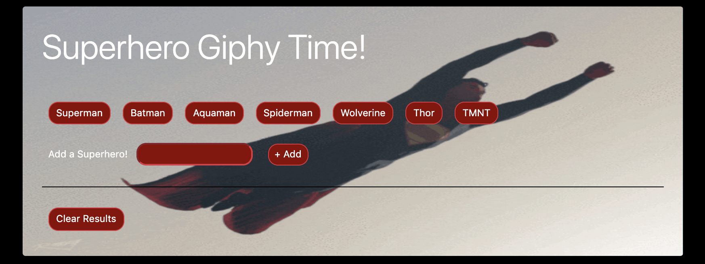
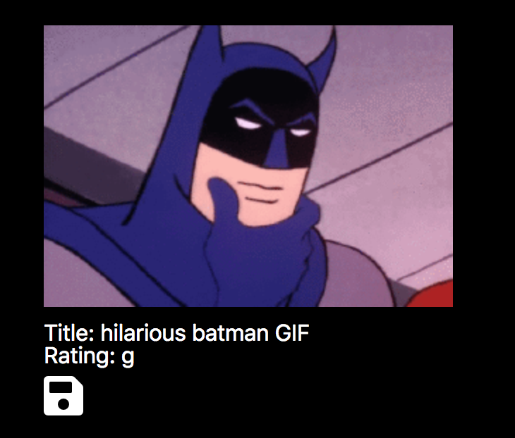

# Giphy Time

### Introduction

In this app, I make use of the GIPHY API to create a dynamic web page that populates with gifs of various superheros. To finish this task, you must call the GIPHY API and use JavaScript and jQuery to change the HTML of your site.

### Overview

1. **Mobile Responsive**.
   * This app uses the bootstrap grid method and flexbox columns to resize to just about any screen size
   * JQuery, Javascript, and FontAwesome are also utilized in this project.

2. **Choose an existing button or create your own**
   * Pre-existing buttons are generated from a Javascript array that is created via a loop and set to the HTML via JQuery.
   * Clicking on any of these buttons triggers an automatic search via the giphy api and will display the results below (see https://developers.giphy.com/).
   * Each search term will show only the first 10 results for that particular search term, but clicking on multiple buttons will add the new results to the display feed for those collective search terms.
   * Adding a new search term to the form input field and clicking on the "+ Add" button will create a new search button of the users choice.
   * The "Clear # Results" button will clear all loaded results but not the search buttons.

3. **Search Results**
   * All gif results will display as still images. Single-clicking or taping on an image will cause the image to start animating. NOTE: there may be a slight delay in the animation depending on the size of the animated gif! 
   * Each gif will have a caption stating it's name (if any) and general rating (like: g, pg, pg-13 etc).
   * The "save" icon will open the giff in a new window for easier download. (Works best on computer browsers)
  
- - -

### Minimum Requirements

Attempt to complete homework assignment as described in instructions. If unable to complete certain portions, please pseudocode these portions to describe what remains to be completed. Adding a README.md as well as adding this homework to your portfolio are required as well and more information can be found below.

- - -

### Bonus Goals

1. Ensure your app is fully mobile responsive.

2. Allow users to request additional gifs to be added to the page.
   * Each request should ADD 10 gifs to the page, NOT overwrite the existing gifs.

3. List additional metadata (title, tags, etc) for each gif in a clean and readable format.

4. Include a 1-click download button for each gif, this should work across device types.

5. Integrate this search with additional APIs such as OMDB, or Bands in Town. Be creative and build something you are proud to showcase in your portfolio

6. Allow users to add their favorite gifs to a `favorites` section.
   * This should persist even when they select or add a new topic.
   * If you are looking for a major challenge, look into making this section persist even when the page is reloaded(via localStorage or cookies).

- - -
